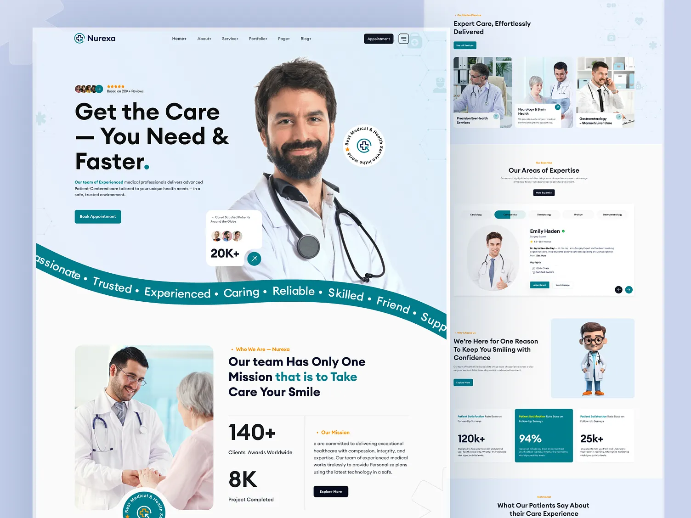

---

# 1. UI Design Principles

The interface should follow **simple healthcare UI standards**:

Design Goals

* Clean medical UI
* Fast patient entry
* Minimal clicks
* Accessible design
* Mobile-first layout
* Clear AI explanations

Design Style

* Soft neutral colors
* Large readable typography
* Clear status indicators
* Card-based layout

---

# 2. Design System

## Color Palette

Primary

```text
Primary Blue      #2563EB
Light Blue        #DBEAFE
Success Green     #22C55E
Warning Yellow    #F59E0B
Danger Red        #EF4444
Gray Background   #F9FAFB
Text Dark         #111827
```

Meaning

| Color  | Meaning         |
| ------ | --------------- |
| Blue   | Primary actions |
| Green  | Completed       |
| Yellow | Medium urgency  |
| Red    | High urgency    |

---

## Typography

Headings

```text
H1 → 32px
H2 → 24px
H3 → 20px
Body → 16px
Small → 14px
```

Font

System font stack

```text
Inter / system-ui
```

---

# 3. Layout Structure

The application uses a **dashboard layout**.

```text
---------------------------------
Navbar
---------------------------------
Sidebar | Main Content Area
       |
       |
---------------------------------
Footer
---------------------------------
```

### Navbar

Elements

* App Logo
* Page Title
* User Icon

Example

```text
AI Hospital System           👤
```

---

### Sidebar

Navigation items

```text
Dashboard
Register Patient
Schedule Appointment
AI Triage
Clinician Dashboard
```

Mobile

Sidebar becomes **hamburger menu**.

---

# 4. Application Screens

Total screens:

1 Home Page
2 Patient Registration
3 Appointment Scheduling
4 AI Triage
5 Clinician Dashboard
6 Appointment Details
7 Confirmation Modals

---

# 5. Home Page

Purpose

Entry point to system.

Layout

```text
---------------------------------
Navbar
---------------------------------

AI-Enabled Hospital Management

Register patients, schedule appointments,
and use AI triage assistance.

[ Register Patient ]
[ Schedule Appointment ]
[ AI Triage ]

---------------------------------

Key Features

✓ Fast patient registration  
✓ Smart scheduling  
✓ AI-assisted triage

---------------------------------
```

Components

* Hero section
* Feature cards
* Quick action buttons

---

# 6. Patient Registration Screen

Purpose

Create new patient records.

Layout

```text
---------------------------------
Register Patient
---------------------------------

Personal Information

First Name        [________]
Last Name         [________]

Date of Birth     [____]
Sex               [dropdown]

Contact Information

Phone             [________]
Email             [________]
Address           [________]

Medical Details

Allergies         [chips input]
Conditions        [chips input]
Medications       [chips input]

[ Register Patient ]
```

---

## Duplicate Detection UI

If phone/email exists

```text
⚠ Patient already exists

Name: Asha Rao
Phone: +91 9xxxx

[ View Record ]
[ Update Details ]
[ Continue Anyway ]
```

---

# 7. Appointment Scheduling Screen

Purpose

Book appointments.

Layout

```text
---------------------------------
Schedule Appointment
---------------------------------

Select Specialty
[Dropdown]

Search Provider
[Search box]

Providers
---------------------------------
Dr Arjun K
General Medicine

Available Slots

[06:00] [06:30] [07:00]

[Book Appointment]

---------------------------------
```

---

## Appointment Confirmation

Modal

```text
Confirm Appointment

Patient: Asha Rao
Provider: Dr Arjun K
Time: 06:00

[Confirm]
[Cancel]
```

---

# 8. Upcoming Appointments Screen

Displays scheduled appointments.

Layout

```text
---------------------------------
Upcoming Appointments
---------------------------------

| Patient | Provider | Time | Status | Actions |
|--------|--------|------|------|------|
| Asha Rao | Dr Arjun | 11:30 | Scheduled | Edit |
| Raj Patel | Dr Meera | 13:00 | Completed | View |

```

Status Colors

| Status    | Color |
| --------- | ----- |
| Scheduled | Blue  |
| Completed | Green |
| Cancelled | Red   |

Actions

* Reschedule
* Cancel
* View

---

# 9. AI Triage Screen

Purpose

Enter symptoms and get AI triage suggestion.

Layout

```text
---------------------------------
AI Triage Assistant
---------------------------------

Symptoms
[ Fever ] [ Cough ] [ Headache ]
[ Free text input ]

Vitals

Temperature      [__]
Heart Rate       [__]
Blood Pressure   [__]
SpO2             [__]

Onset Days       [__]
Pain Scale       [slider]

Upload file (optional)
[Choose File]

[ Run AI Triage ]
```

---

# 10. AI Result Screen

After calling mock AI API.

Layout

```text
---------------------------------
AI Triage Result
---------------------------------

Urgency Level
Medium (74% confidence)

Possible Conditions

1 Viral Pharyngitis (68%)
2 Streptococcal Pharyngitis (22%)

Recommended Steps

• Hydration
• Rest
• Consider rapid strep test

Explanation

Fever and sore throat with stable vitals
suggest viral infection.

---------------------------------

⚠ Disclaimer

Not medical advice.
Prototype using synthetic data only.
```

Urgency Colors

| Urgency | Color  |
| ------- | ------ |
| Low     | Green  |
| Medium  | Yellow |
| High    | Red    |

---

# 11. Clinician Dashboard

Purpose

View today's appointments and AI triage results.

Layout

```text
---------------------------------
Clinician Dashboard
---------------------------------

Filters

Date [____]
Provider [Dropdown]

---------------------------------

| Patient | Provider | Time | Status | AI Urgency |
|--------|--------|------|------|------|
| Asha Rao | Dr Arjun | 11:30 | Scheduled | Medium |
| Ravi Kumar | Dr Meera | 13:00 | Completed | Low |

---------------------------------
```

---

# 12. Appointment Details Panel

Popup

```text
---------------------------------
Appointment Details
---------------------------------

Patient: Asha Rao
Provider: Dr Arjun
Time: 11:30

Reason
Fever and sore throat

AI Triage
Medium urgency

Possible Diagnosis
Viral Pharyngitis

---------------------------------
```

---

# 13. Mobile UI Layout

Mobile priority: **360px**

Sidebar becomes menu.

Example

```text
☰ AI Hospital

Dashboard

Register
Schedule
Triage
```

Forms become **single column**.

---

# 14. Accessibility Design

Requirements

* Keyboard navigation
* Screen reader support
* Labels for inputs
* Focus states

Example

```html
<label for="phone">Phone</label>
<input id="phone" type="tel" />
```

Contrast ratio

```text
Minimum 4.5:1
```

---

# 15. UI Components Library

Reusable components

```text
Button
Input
Select
Card
Badge
Modal
Table
Tabs
Alert
```

Example

```text
components/ui
```

Structure

```text
ui
├ Button
├ Input
├ Card
├ Modal
├ Badge
└ Table
```

---

# 16. User Flow

### Patient Registration Flow

```text
Home
 ↓
Register Patient
 ↓
Fill Form
 ↓
Submit
 ↓
Patient Created
```

---

### Appointment Flow

```text
Select Patient
 ↓
Select Provider
 ↓
Choose Slot
 ↓
Confirm Appointment
```

---

### AI Triage Flow

```text
Enter Symptoms
 ↓
Submit
 ↓
AI Result
 ↓
Display Diagnosis Suggestions
```

---

# 17. Loading and Error States

Loading example

```text
Loading providers...
```

Error example

```text
⚠ Failed to load providers
Retry
```

---

# 18. Final Screen List

Total screens:

```text
Home
Patient Registration
Appointment Scheduling
Appointment List
AI Triage
AI Result
Clinician Dashboard
Appointment Details
```

---

✅ This **UI/UX architecture is exactly what companies expect in frontend assignments**.
